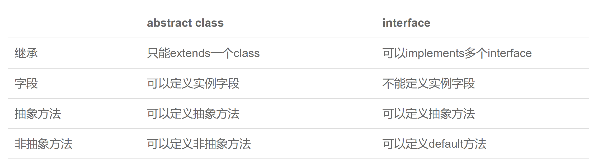

# Java 面向对象编程 - 学习笔记

>**面向对象编程**（**Object-Oriented Programming / OOP**），是一种通过对象的方式，把现实世界映射到计算机模型的一种编程方法。Java语言作为静态面向对象编程语言的代表，极好地实现了面向对象理论，允许程序员以优雅的思维方式进行复杂的编程。
>
>**参考资料：**
>
>+ [面向对象程序设计——Java语言 - 中国大学MOOC]( https://www.icourse163.org/course/ZJU-1001542001 )
>+ [Java 面向对象编程 - 廖雪峰的官方网站](https://www.liaoxuefeng.com/wiki/1252599548343744/1255943520012800)
>+ [Java 面向对象 - W3Cschool]( https://www.w3cschool.cn/java/utew7f21.html )
>+ [Java 教程 - 菜鸟教程](https://www.runoob.com/java/java-tutorial.html)

## 1 类与实例

现实世界中，我们定义了“人”这种抽象概念，而具体的人则是“小明”、“小红”、“小军”等一个个具体的人。所以，“人”可以定义为一个类（class），而具体的人则是实例（instance）：


在OOP中，class和instance是“模版”和“实例”的关系；
定义class就是定义了一种数据类型，对应的instance是这种数据类型的实例；

### 定义class

在Java中，创建一个类，例如，给这个类命名为Person，就是定义一个class：

```java
class Person {
    public String name;
    public int age;
}
/*
一个class可以包含多个字段（field），字段用来描述一个类的特征。上面的Person类，我们定义了两个字段，一个是String类型的字段，命名为name，一个是int类型的字段，命名为age。因此，通过class，把一组数据汇集到一个对象上，实现了数据封装。public是用来修饰字段的，它表示这个字段可以被外部访问。
*/
```

### 创建实例

定义class只是定义了对象模版，而要根据对象模版创建出真正的对象实例，需要用new操作符：

```java
Person ming = new Person();
// 上述代码创建了一个Person类型的实例，并通过变量ming指向它。
// 注意区分Person ming是定义Person类型的变量ming，而new Person()是创建Person实例。
```

有了指向这个实例的变量，我们就可以通过这个变量来操作实例。访问实例变量可以用变量.字段，例如：

```java
ming.name = "Xiao Ming"; // 对字段name赋值
ming.age = 12; // 对字段age赋值
System.out.println(ming.name); // 访问字段name
```

**注意**：指向instance的变量都是引用变量，每个instance都会拥有各自的field，且互不干扰。

### 练习：定义类City

```java
public class Main {
    public static void main(String[] args) {
        City bj = new City();
        bj.name = "Beijing";
        bj.latitude = 39.903;
        bj.longitude = 116.401;
        System.out.println(bj.name);
        System.out.println("location: " + bj.latitude + ", " + bj.longitude);
    }
}

class City {
    public String name;
    public double latitude;
    public double longitude;
}
```

## 2 方法

### private字段

一个class可以包含多个field，但直接把field用public暴露给外部可能会破坏封装性，造成逻辑混乱。为了避免外部代码直接去访问field，我们可以用private修饰field，拒绝外部访问：

```java
class Person {
    private String name;
    private int age;
}

```

把field从public改成private，外部代码不能访问这些field，需要使用方法（method）来让外部代码可以间接修改field。
例如：

```java
public class Main {
    public static void main(String[] args) {
        Person ming = new Person();
        ming.setName("Xiao Ming"); // 设置name
        ming.setAge(12); // 设置age
        System.out.println(ming.getName() + ", " + ming.getAge());
    }
}

class Person {
    private String name;
    private int age;

    public String getName() {
        return this.name;
    }

    public void setName(String name) {
        this.name = name;
    }

    public int getAge() {
        return this.age;
    }

    public void setAge(int age) {
        if (age < 0 || age > 100) {
            throw new IllegalArgumentException("invalid age value");
        }
        this.age = age;
    }
}
```

### 定义方法

定义方法的语法是：

```java
修饰符 方法返回类型 方法名(方法参数列表) {
    若干方法语句;
    return 方法返回值;
}
```

方法返回值通过return语句实现，如果没有返回值，返回类型设置为void，可以省略return。调用方法的语法是实例变量.方法名(参数); 一个方法调用就是一个语句。

### private方法

和private字段一样，private方法不允许外部调用，而内部方法是可以调用private方法的。

```java
public class Main {
    public static void main(String[] args) {
        Person ming = new Person();
        ming.setBirth(2008);
        System.out.println(ming.getAge());
    }
}

class Person {
    private String name;
    private int birth;

    public void setBirth(int birth) {
        this.birth = birth;
    }

    public int getAge() {
        return calcAge(2019); // 调用private方法
    }

    // private方法:
    private int calcAge(int currentYear) {
        return currentYear - this.birth;
    }
}
```

### this变量

在方法内部，可以使用一个隐含的变量this，始终指向当前实例，通过this.field就可以访问当前实例的字段。

*注*：如果没有命名冲突，可以省略this；但如有局部变量和字段重名，那么局部变量优先级更高，就必须加上this。

### 方法参数

方法可以包含0个或任意个参数用于接收传递给方法的变量值。调用方法时，必须严格按照参数的定义一一传递。

### 可变参数

可变参数用类型...定义，可变参数相当于数组类型，例如：

```java
class Group {
    private String[] names;
  //下面的setNames()定义了一个可变参数
    public void setNames(String... names) {
        this.names = names;
    }
}
```

在调用setNames()时，可以这么写：

```java
Group g = new Group();
g.setNames("Xiao Ming", "Xiao Hong", "Xiao Jun"); // 传入3个String
g.setNames("Xiao Ming", "Xiao Hong"); // 传入2个String
g.setNames("Xiao Ming"); // 传入1个String
g.setNames(); // 传入0个String
```

**注**：可变参数可以保证无法传入null，因为传入0个参数时，接收到的实际值是一个空数组而不是null。

### 参数绑定

调用方把参数传递给实例方法时，调用时传递的值会按参数位置一一绑定。

+ 基本类型参数的传递，是调用方值的复制，双方各自的后续修改互不影响。
+ 引用类型参数的传递，调用方的变量和接收方的参数变量指向的是同一个对象，双方任意一方对这个对象的修改，都会影响对方。

### 练习：给Person类增加getAge/setAge方法 

```java
public class Main {

    public static void main(String[] args) {
        Person ming = new Person();
        ming.setName("小明");
        System.out.println(ming.getName());
        ming.setAge(12);
        System.out.println(ming.getAge());
    }

}

public class Person {

    private String name;
    private int age;

    public String getName() {
        return name;
    }

    public void setName(String name) {
        this.name = name;
    }

    // FIXME: 给Person增加getAge/setAge方法:

    public int getAge() {
        return age;
    }

    public void setAge(int age) {
        this.age = age;
    }
}

```

## 3 构造方法

### 定义构造方法

能否在创建对象实例时就把内部字段全部初始化为合适的值？完全可以。这时，我们就需要构造方法，它能在创建Person实例的时候，一次性传入name和age，完成初始化：

```java
public class Main {
    public static void main(String[] args) {
        Person p = new Person("Xiao Ming", 15);
        System.out.println(p.getName());
        System.out.println(p.getAge());
    }
}

class Person {
    private String name;
    private int age;
  // 构造方法
    public Person(String name, int age) {
        this.name = name;
        this.age = age;
    }
    
    public String getName() {
        return this.name;
    }

    public int getAge() {
        return this.age;
    }
}

```

构造方法的名称就是类名。构造方法的参数没有限制，在方法内部，也可以编写任意语句。但是，和普通方法相比，构造方法没有返回值（也没有void），调用构造方法，必须用new操作符。

### 默认构造方法

实例在创建时通过new操作符会调用其对应的构造方法，构造方法用于初始化实例；没有定义构造方法时，编译器会自动创建一个默认的无参数构造方法：

```java
class Person {
    public Person() {
    }
}
//调用此构造方法时使用调用new Person()

```

而当我们自定义了一个构造方法，那么，编译器就不再自动创建默认的无参数构造方法，调用时必须输入相应参数；如果既要能使用带参数的构造方法，又想保留不带参数的构造方法，那么只能把两个构造方法都定义出来。

### 多构造方法

事实上，我们可以定义多个构造方法，在通过new操作符调用的时候，编译器通过构造方法的参数数量、位置和类型自动区分：

```java
class Person {
    private String name;
    private int age;

    public Person(String name, int age) {
        this.name = name;
        this.age = age;
    }

    public Person(String name) {
        this.name = name;
        this.age = 12;
    }

    public Person() {
    }
}
/*
如果调用new Person("Xiao Ming", 20);，会自动匹配到构造方法public Person(String, int)。
如果调用new Person("Xiao Ming");，会自动匹配到构造方法public Person(String)。
如果调用new Person();，会自动匹配到构造方法public Person()。
*/

```

一个构造方法可以调用其他构造方法，语法是this(…)：

```java
class Person {
    private String name;
    private int age;

    public Person(String name, int age) {
        this.name = name;
        this.age = age;
    }

    public Person(String name) {
        this(name, 18); // 调用另一个构造方法Person(String, int)
    }

    public Person() {
        this("Unnamed"); // 调用另一个构造方法Person(String)
    }
}

```


### 练习：给Person类增加(String, int)的构造方法

```java
//Main.java

public class Main {

	public static void main(String[] args) {
		Person ming = new Person("小明", 12);
		System.out.println(ming.getName());
		System.out.println(ming.getAge());
	}

}
//Person.java

public class Person {

	private String name;
	private int age;
	
	public Person(String name, int age) {
		this.name = name;
		this.age = age;
	}

	public String getName() {
		return name;
	}

	
	public int getAge() {
		return age;
	}

```


## 4 方法重载

在一个类中，我们可以定义多个方法。如果有一系列方法，它们的功能都是类似的，只有参数有所不同，那么，可以把这一组方法名做成同名方法，称为方法重载（Overload）。

**注意**：重载方法应该完成类似的功能，返回值类型通常都是相同的。

方法重载的目的是，功能类似的方法使用同一名字，更容易记住，因此，调用起来更简单。例如，String类提供了多个重载方法indexOf()，可以查找子串：

```java
int indexOf(int ch)：根据字符的Unicode码查找；
int indexOf(String str)：根据字符串查找；
int indexOf(int ch, int fromIndex)：根据字符查找，但指定起始位置；
int indexOf(String str, int fromIndex)根据字符串查找，但指定起始位置。

```

### 练习：给Person增加重载方法

```java
//Main.java
public class Main {

	public static void main(String[] args) {
		Person ming = new Person();
		ming.setName("Xiao Ming");
		System.out.println(ming.getName());
		Person hong = new Person();
		hong.setName("Xiao", "Hong");
		System.out.println(hong.getName());
	}

}
//Person.java

public class Person {

	private String name;

	public String getName() {
		return name;
	}

	public void setName(String name) {
		this.name = name;
	}

    // FIXME: 给Person增加重载方法setName(String, String):
	public void setName(String preName, String postName) {
		this.name = preName + " " + postName;
	}
}

```

## 5 继承

在前面的章节中，我们已经定义了Person类：

```java
class Person {
    private String name;
    private int age;

    public String getName() {...}
    public void setName(String name) {...}
    public int getAge() {...}
    public void setAge(int age) {...}
}

```

现在，假设需要定义一个Student类：

```java
class Student {
    private String name;
    private int age;
    private int score;

    public String getName() {...}
    public void setName(String name) {...}
    public int getAge() {...}
    public void setAge(int age) {...}
    public int getScore() { … }
    public void setScore(int score) { … }
}

```

仔细观察，发现Student类包含了Person类已有的字段和方法，只是多出了一个score字段和相应的getScore()、setScore()方法。这个时候，继承就派上用场了。当我们让Student从Person继承时，Student就获得了Person的所有功能，我们只需要为Student编写新增的功能。Java使用extends关键字来实现继承：

```java
class Person {
    private String name;
    private int age;

    public String getName() {...}
    public void setName(String name) {...}
    public int getAge() {...}
    public void setAge(int age) {...}
}

class Student extends Person {
    // 不要重复name和age字段/方法,
    // 定义新增score字段/方法:
    private int score;

    public int getScore() { … }
    public void setScore(int score) { … }
}

```

可见，通过继承，Student只需要编写额外的功能，不再需要重复代码。

在OOP的术语中，我们把Person称为超类（super class），父类（parent class），基类（base class），把Student称为子类（subclass），扩展类（extended class）。

### 继承树

注意到我们在定义Person的时候，没有写extends。在Java中，没有明确写extends的类，编译器会自动加上extends Object。所以，任何类，除了Object，都会继承自某个类。下图是Person、Student的继承树：


Java只允许一个class继承自一个类，因此，一个类有且仅有一个父类。只有Object特殊，它没有父类。
类似的，如果我们定义一个继承自Person的Teacher，它们的继承树关系如下：


### protected

继承有个特点，就是子类无法访问父类的private字段或者private方法。
为了让子类可以访问父类的字段，我们需要把private改为protected。
用protected修饰的字段可以被子类访问protected关键字可以把字段和方法的访问权限控制在继承树内部，一个protected字段和方法可以被其子类，以及子类的子类所访问：

```java
class Person {
    protected String name;
    protected int age;
}

class Student extends Person {
    public String hello() {
        return "Hello, " + name; 
    }
}

```

### super

super关键字表示父类（超类）。子类引用父类的字段时，可以用super.fieldName:

```java
class Student extends Person {
    public String hello() {
        return "Hello, " + super.name;
    }
}

```

实际上，这里使用super.name，或者this.name，或者name，效果都是一样的。编译器会自动定位到父类的name字段。
但是，在某些时候，就必须使用super:

```java
public class Main {
    public static void main(String[] args) {
        Student s = new Student("Xiao Ming", 12, 89);
    }
}

class Person {
    protected String name;
    protected int age;

    public Person(String name, int age) {
        this.name = name;
        this.age = age;
    }
}

class Student extends Person {
    protected int score;

    public Student(String name, int age, int score) {
        //super(); 自动调用父类的构造方法
        this.score = score;
    }
}

```

运行上面的代码，会得到一个编译错误，大意是在Student的构造方法中，无法调用Person的构造方法。
这是因为在Java中，任何class的构造方法，第一行语句必须是调用父类的构造方法。如果没有明确地调用父类的构造方法，编译器会帮我们自动加一句无参数的super();
但是，Person类并没有无参数的构造方法，因此，编译失败。解决方法是调用Person类存在的某个构造方法，例如:

```java
class Student extends Person {
    protected int score;

    public Student(String name, int age, int score) {
        super(name, age); // 调用父类的构造方法Person(String, int)
        this.score = score;
    }
}
//编译成功!

```

因此我们得出结论：如果父类没有默认的（无参数）构造方法，子类就必须显式调用super()并给出参数以便让编译器定位到父类的一个合适的构造方法。
这里还顺带引出了另一个问题：即子类不会继承任何父类的构造方法。子类默认的构造方法是编译器自动生成的，不是继承的。

### 向上转型

```java
Student s = new Student(); //一个引用变量的类型是Student，指向一个Student类型的实例
Person p = new Person(); //一个引用类型的变量是Person，指向一个Person类型的实例

//如果Student是从Person继承下来的，那么，一个引用类型为Person的变量，能否指向Student类型的实例?
Person p = new Student(); // OK

```

Student继承自Person，因此，它拥有Person的全部功能。Person类型的变量，如果指向Student类型的实例，对它进行操作，是没有问题的！
这种把一个子类类型安全地变为父类类型的赋值，被称为向上转型（upcasting）。向上转型实际上是把一个子类型安全地变为更加抽象的父类型：

```java
Student s = new Student();
Person p = s; // upcasting, ok
Object o1 = p; // upcasting, ok
Object o2 = s; // upcasting, ok
//注意到继承树是Student > Person > Object，所以，可以把Student类型转型为Person，或者更高层次的Object。

```


### 向下转型

和向上转型相反，如果把一个父类类型强制转型为子类类型，就是向下转型（downcasting）。例如：

```java
Person p1 = new Student(); // upcasting, ok
Person p2 = new Person();
Student s1 = (Student) p1; // ok
Student s2 = (Student) p2; // runtime error! ClassCastException!

```

Person类型p1实际指向Student实例，Person类型变量p2实际指向Person实例。在向下转型的时候，把p1转型为Student会成功，因为p1确实指向Student实例；把p2转型为Student会失败，因为p2的实际类型是Person，不能把父类变为子类，因为子类功能比父类多，多的功能无法凭空变出来。

因此，向下转型很可能会失败。失败的时候，Java虚拟机会报ClassCastException。为了避免向下转型出错，Java提供了instanceof操作符，可以先判断一个实例究竟是不是某种类型：

```java
Person p = new Person();
System.out.println(p instanceof Person); // true
System.out.println(p instanceof Student); // false

Student s = new Student();
System.out.println(s instanceof Person); // true
System.out.println(s instanceof Student); // true

Student n = null;
System.out.println(n instanceof Student); // false

```

instanceof实际上判断一个变量所指向的实例是否是指定类型，或者这个类型的子类。如果一个引用变量为null，那么对任何instanceof的判断都为false。

利用instanceof，在向下转型前可以先判断：

```java
Person p = new Student();
if (p instanceof Student) {
    // 只有判断成功才会向下转型:
    Student s = (Student) p; // OK
}

```


### 区分继承和组合

在使用继承时，我们要注意逻辑一致性。
考察下面的Book类：

```java
class Book {
    protected String name;
    public String getName() {...}
    public void setName(String name) {...}
}

```

这个Book类也有name字段，那么，我们能不能让Student继承自Book呢？显然，从逻辑上讲，这是不合理的，Student不应该从Book继承，而应该从Person继承。
究其原因，是因为Student是Person的一种，它们是is关系，而Student并不是Book。
实际上Student和Book的关系是has关系，具有has关系不应该使用继承，而是使用组合，即Student可以持有一个Book实例：

```java
class Student extends Person {
    protected Book book;
    protected int score;
}

```

### 练习：定义PrimaryStudent

```java
//Main.java
public class Main {

	public static void main(String[] args) {
		Person p = new Person("小明", 12);
		Student s = new Student("小红", 20, 99);
		// TODO: 定义PrimaryStudent，从Student继承，新增grade字段:
		Student ps = new PrimaryStudent("小军", 9, 100, 5);
		System.out.println(ps.getScore());
		System.out.println(((PrimaryStudent)ps).getGrade());
	}

}

//Person.java
public class Person {

	protected String name;
	protected int age;

	public Person(String name, int age) {
		this.name = name;
		this.age = age;
	}

	public String getName() {
		return name;
	}

	public void setName(String name) {
		this.name = name;
	}

	public int getAge() {
		return age;
	}

	public void setAge(int age) {
		this.age = age;
	}

}

//Student.java
public class Student extends Person {

	protected int score;

	public Student(String name, int age, int score) {
		super(name, age);
		this.score = score;
	}

	public int getScore() {
		return score;
	}

	
}

//PrimaryStudent.java
public class PrimaryStudent extends Student{
	
	protected int grade;
	
	public PrimaryStudent(String name, int age, int score, int grade) {
		super(name, age, score);
		this.grade = grade;
	}
	
	public int getGrade() {
		return grade;
	}

}

```

## 6  多态

### 覆写与多态

在继承关系中，子类如果定义了一个与父类方法签名完全相同的方法，被称为覆写（Override）。
例如，在Person类中，我们定义了run()方法：

```java
class Person {
    public void run() {
        System.out.println("Person.run");
    }
}

```

在子类Student中，覆写这个run()方法：

```java
class Student extends Person {
    @Override
    public void run() {
        System.out.println("Student.run");
    }
}

```

+ 覆写(Override)和重载(Overload)

1. 如果方法签名如果不同，就是Overload，Overload方法是一个新方法（方法名、返回值相同，但各自参数不同）；
2. 如果方法签名完全相同，并且返回值也相同，就是Override。

**注意**：方法名相同，方法参数相同，但方法返回值不同，也是不同的方法。在Java程序中，出现这种情况，编译器会报错。

加上@Override可以让编译器帮助检查是否进行了正确的覆写。希望进行覆写，但是不小心写错了方法签名，编译器会报错，但@Override不是必需的。

上一节已经提到，引用变量的声明类型可能与其实际类型不符，例如：Person p = new Student();
现在，我们考虑一种情况，如果子类覆写了父类的方法：

```java
public class Main {
    public static void main(String[] args) {
        Person p = new Student();
        p.run();   // 打印出Student.run
    }
}

class Person {
    public void run() {
        System.out.println("Person.run");
    }
}

class Student extends Person {
    @Override
    public void run() {
        System.out.println("Student.run");
    }
}

```

那么，一个实际类型为Student，引用类型为Person的变量，调用其run()方法，调用的是Person还是Student的run()方法？
运行一下上面的代码就可以知道，实际上调用的方法是Student的run()方法。

**结论**：Java的实例方法调用是基于运行时的实际类型的动态调用，而非变量的声明类型。
这个非常重要的特性在面向对象编程中称之为 **多态（Polymorphic）**。

假设我们编写这样一个方法：

```java
public void runTwice(Person p) {
    p.run();
    p.run();
}

```

它传入的参数类型是Person，我们是无法知道传入的参数实际类型究竟是Person，还是Student，还是Person的其他子类，因此，也无法确定调用的是不是Person类定义的run()方法。

所以，多态的特性就是，运行期才能动态决定调用的子类方法。对某个类型调用某个方法，执行的实际方法可能是某个子类的覆写方法。

例如：

```java
public class Main {
    public static void main(String[] args) {
        // 给一个有普通收入、工资收入和享受国务院特殊津贴的人算税:
        Income[] incomes = new Income[] {
            new Income(3000),
            new Salary(7500),
            new StateCouncilSpecialAllowance(15000)
        };
        System.out.println(totalTax(incomes));
    }

    public static double totalTax(Income... incomes) {
        double total = 0;
        for (Income income: incomes) {
            total = total + income.getTax();
        }
        return total;
    }
}

class Income {
    protected double income;

    public Income(double income) {
        this.income = income;
    }

    public double getTax() {
        return income * 0.1; // 税率10%
    }
}

class Salary extends Income {
    public Salary(double income) {
        super(income);
    }

    @Override
    public double getTax() {
        if (income <= 5000) {
            return 0;
        }
        return (income - 5000) * 0.2;
    }
}

class StateCouncilSpecialAllowance extends Income {
    public StateCouncilSpecialAllowance(double income) {
        super(income);
    }

    @Override
    public double getTax() {
        return 0;
    }
}
```

观察totalTax()方法：利用多态，totalTax()方法只需要和Income打交道，它完全不需要知道Salary和StateCouncilSpecialAllowance的存在，就可以正确计算出总的税。

可见，多态具有一个非常强大的功能，就是允许添加更多类型的子类实现功能扩展，却不需要修改基于父类的代码。

### 覆写Object方法

因为所有的class最终都继承自Object，而Object定义了几个重要的方法：

+ toString()：把instance输出为String；
+ equals()：判断两个instance是否逻辑相等；
+ hashCode()：计算一个instance的哈希值。
  在必要的情况下，我们可以覆写Object的这几个方法，例如：

```java
class Person {
    ...
    // 显示更有意义的字符串:
    @Override
    public String toString() {
        return "Person:name=" + name;
    }

    // 比较是否相等:
    @Override
    public boolean equals(Object o) {
        // 当且仅当o为Person类型:
        if (o instanceof Person) {
            Person p = (Person) o;
            // 并且name字段相同时，返回true:
            return this.name.equals(p.name);
        }
        return false;
    }

    // 计算hash:
    @Override
    public int hashCode() {
        return this.name.hashCode();
    }
}

```

### 调用super

在子类的覆写方法中，如果要调用父类的被覆写的方法，可以通过super来调用。例如：

```java
class Person {
    protected String name;
    public String hello() {
        return "Hello, " + name;
    }
}

Student extends Person {
    @Override
    public String hello() {
        // 调用父类的hello()方法:
        return super.hello() + "!";
    }
}

```

### final

final修饰符有多种作用：

+ final修饰的方法可以阻止被覆写；
+ final修饰的class可以阻止被继承；
+ final修饰的field必须在创建对象时初始化，随后不可修改。

**注**：可以在构造方法中初始化final字段：

```java
class Person {
    public final String name;
    public Person(String name) {
        this.name = name;
    }
}
// 这种方法可以保证实例一旦创建，其final字段就不可修改。
```

### 练习：计算所得税 

```java
//Main.java
public class Main {

	public static void main(String[] args) {
		// TODO: 给一个有工资收入和稿费收入的小伙伴算税:
		Income[] incomes = new Income[] { new Income(3000), new SalaryIncome(7500), new RoyaltyIncome(12000) };
		double total = 0;
		for (Income income : incomes) {
			total += income.getTax();
		}
		System.out.println(total);
	}

}

//Income.java

public class Income {

	protected double income;

	public Income(double income) {
		this.income = income;
	}

	public double getTax() {
		return income * 0.1; // 税率10%
	}

}

//SalaryIncome.java

public class SalaryIncome extends Income {

	public SalaryIncome(double income) {
		super(income);
	}

	@Override
	public double getTax() {
		if (income <= 5000) {
			return 0;
		}
		return (income - 5000) * 0.2;
	}
}

//RoyaltyIncome.java

public class RoyaltyIncome extends Income{

	public RoyaltyIncome(double income) {
		super(income);
	}

	@Override
	public double getTax() {
		
		return income * 0.2;  //稿费收入税率是20%
	}

}
```

## 7 抽象类

### 抽象方法

由于多态的存在，每个子类都可以覆写父类的方法，例如：

```java
class Person {
    public void run() { … }
}

class Student extends Person {
    @Override
    public void run() { … }
}

class Teacher extends Person {
    @Override
    public void run() { … }
}

```

从Person类派生的Student和Teacher都可以覆写run()方法。如果父类Person的run()方法没有实际意义，能否去掉方法的执行语句？

```java
class Person {
    public void run(); // Compile Error!
} // 定义方法的时候，必须实现方法的语句

```

能不能去掉父类的run()方法？答案还是不行，因为去掉父类的run()方法，就失去了多态的特性。例如，runTwice()就无法编译：

```java
public void runTwice(Person p) {
    p.run(); // Person没有run()方法，会导致编译错误
    p.run();
}

```

如果父类的方法本身不需要实现任何功能，仅仅是为了定义方法签名，目的是让子类去覆写它，那么，可以把父类的方法声明为abstract，把一个方法声明为abstract，它只有定义，没有实现。所以，此类也无法被实例化，必须把父类本身也声明为abstract，这样编译器才能正确编译它：

```java
abstract class Person {
    public abstract void run();
}

```

### 抽象类

如果一个class定义了方法，但没有具体执行代码，这个方法就是抽象方法，抽象方法用abstract修饰。因为无法执行抽象方法，因此这个类也必须申明为抽象类（abstract class），我们无法实例化一个抽象类。

抽象类本身被设计成只能用于被继承，因此，抽象类可以强迫子类实现其定义的抽象方法，否则编译会报错。
因此，抽象方法实际上定义了子类必须实现的接口**规范**；
例如：(Person类定义了抽象方法run()，那么，在实现子类Student的时候，就必须覆写run()方法)

```java
public class Main {
    public static void main(String[] args) {
        Person p = new Student();
        p.run();
    }
}

abstract class Person {
    public abstract void run();
}

class Student extends Person {
    @Override
    public void run() {
        System.out.println("Student.run"); 
    }
}

```

### 面向抽象编程

当我们定义了抽象类Person，以及具体的Student、Teacher子类的时候，我们可以通过抽象类Person类型去引用具体的子类的实例：

```java
Person s = new Student();
Person t = new Teacher();

```

这种引用抽象类的好处在于，我们对其进行方法调用，并不关心Person类型变量的具体子类型：

```java
s.run();
t.run();

```

这种尽量引用高层类型，避免引用实际子类型的方式，称之为面向抽象编程，其本质就是：

+ 上层代码只定义规范（例如：abstract class Person）；
+ 不需要子类就可以实现业务逻辑（正常编译）；
+ 具体的业务逻辑由不同的子类实现，调用者并不关心。

### 练习：用抽象类算税 

```java
// Main.java
public class Main {

	public static void main(String[] args) {
		// TODO: 用抽象类给一个有工资收入和稿费收入的小伙伴算税:
		Income[] incomes = new Income[] { new SalaryIncome(7500), new RoyaltyIncome(12000) };
		double total = 0;
		for(Income income : incomes) {
			total += income.getTax();
		}
		System.out.println(total);
	}

}


// Income.java
/**
 * 定义抽象类Income
 */
public abstract class Income {

	protected double income;

	public Income(double income) {
		this.income = income;
	}

	public abstract double getTax() ;

}


//SalaryIncome.java

public class SalaryIncome extends Income {

	public SalaryIncome(double income) {
		super(income);
	}

	@Override
	public double getTax() {
		if (income <= 5000) {
			return 0;
		}
		return (income - 5000) * 0.2;
	}

}


//RoyaltyIncome.java

public class RoyaltyIncome extends Income {

	public RoyaltyIncome(double income) {
		super(income);
	}
	
	@Override
	public double getTax() {
		
		return income * 0.2; 
	}

}

```

## 8 接口

### interface

在抽象类中，抽象方法本质上是定义接口规范：即规定高层类的接口，从而保证所有子类都有相同的接口实现。
如果一个抽象类没有字段，所有方法全部都是抽象方法，如：

```java
abstract class Person {
    public abstract void run();
    public abstract String getName();
}

```

可以把该抽象类改写为接口（interface）：

```java
interface Person {
    void run();
    String getName();
}

```

在Java中，使用interface可以声明一个接口。interface是比抽象类还要抽象的纯抽象接口，因为它连字段都不能有。接口定义的所有方法默认都是public abstract的，所以这两个修饰符不需要写出来（写不写效果都一样）。

当一个具体的class去实现一个interface时，需要使用implements关键字。例如：

```java
class Student implements Person {
    private String name;

    public Student(String name) {
        this.name = name;
    }

    @Override
    public void run() {
        System.out.println(this.name + " run");
    }

    @Override
    public String getName() {
        return this.name;
    }
}
```

**注意**：在Java中，一个类只能继承自另一个类，不能从多个类继承。但是，一个类可以实现多个interface

```java
class Student implements Person, Hello { // 实现了两个interface
    ...
}
```

### 术语

Java的接口特指interface的定义，表示一个接口类型和一组方法签名，而编程接口泛指接口规范，如方法签名，数据格式，网络协议等。抽象类和接口的对比如下：



### 接口继承

一个interface可以继承自另一个interface。interface继承使用extends，它相当于扩展了接口的方法。

```java
interface Hello {
    void hello();
}

interface Person extends Hello {
    void run();
    String getName();
}
```

此时，Person接口继承自Hello接口，因此，Person接口现在实际上有3个抽象方法签名，其中一个来自继承的Hello接口。

### default方法

在接口中，可以定义default方法。例如，把Person接口的run()方法改为default方法：

```java
public class Main {
    public static void main(String[] args) {
        Person p = new Student("Xiao Ming");
        p.run();
    }
}

interface Person {
    String getName();
    default void run() {
        System.out.println(getName() + " run");
    }
}

class Student implements Person {
    private String name;

    public Student(String name) {
        this.name = name;
    }

    public String getName() {
        return this.name;
    }
}
```

实现类可以不必覆写default方法。default方法的目的是，当我们需要给接口新增一个方法时，会涉及到修改全部子类，如果新增的是default方法，那么子类就不必全部修改，只需要在需要覆写的地方去覆写新增方法。

default方法和抽象类的普通方法是有所不同的。因为interface没有字段，default方法无法访问字段，而抽象类的普通方法可以访问实例字段。

### 练习：用接口算税

```java
// Main.java

public class Main {

	public static void main(String[] args) {
		// TODO: 用接口给一个有工资收入和稿费收入的小伙伴算税:
		Income[] incomes = new Income[] { new OtherIncome(3000), new SalaryIncome(7500), new RoyaltyIncome(12000) };
		double total = 0;
		for (Income income : incomes) {
			total += income.getTax();
		}
		System.out.println(total);
	}

}
// Income.java

/**
 * 定义接口Income
 */

public interface Income {

	double getTax();

}

// OtherIncome.java

public class OtherIncome implements Income {
	protected double income;
	
	public OtherIncome (double income) {
		this.income = income;
	}
	
	@Override
	public double getTax() {
	
		return income * 0.1;
	}

}

//SalaryIncome.java

public class SalaryIncome implements Income {
	protected double income;

	public SalaryIncome(double income) {
		this.income = income;
	}

	@Override
	public double getTax() {
		if (income <= 5000) {
			return 0;
		}
		return income * 0.2;
	}

}

//RoyaltyIncome.java
public class RoyaltyIncome implements Income {
	protected double income;
	
	public RoyaltyIncome(double income) {
		this.income = income;
	}
	
	@Override
	public double getTax() {
		return income * 0.2;
	}

}

```


## 9 静态字段和静态方法

### 静态字段

在一个class中定义的字段，我们称之为实例字段。实例字段的特点是，每个实例都有独立的字段，各个实例的同名字段互不影响。
还有一种字段，是用static修饰的字段，称为静态字段：static field。
实例字段在每个实例中都有自己的一个独立“空间”，但是静态字段只有一个共享“空间”，所有实例都会共享该字段。

```java
public class Main {
    public static void main(String[] args) {
        Person ming = new Person("Xiao Ming", 12);
        Person hong = new Person("Xiao Hong", 15);
        ming.number = 88;
        System.out.println(hong.number); // 88
        hong.number = 99;
        System.out.println(ming.number); // 99
    }
}

class Person {
    public String name;
    public int age;

// 定义静态字段number:
    public static int number;

    public Person(String name, int age) {
        this.name = name;
        this.age = age;
    }
}

```

对于静态字段，无论修改哪个实例的静态字段，效果都是一样的： 所有实例的静态字段都被修改了，原因是静态字段并不属于实例; 虽然实例可以访问静态字段，但是它们指向的其实都是Person class的静态字段，也即所有实例共享一个静态字段。

因此，不推荐用实例变量.静态字段去访问静态字段，因为在Java程序中，实例对象并没有静态字段。在代码中，实例对象能访问静态字段只是因为编译器可以根据实例类型自动转换为类名.静态字段来访问静态对象。推荐用类名来访问静态字段。可以把静态字段理解为描述class本身的字段（非实例字段）。对于上面的代码，更好的写法是：

```java
Person.number = 99;
System.out.println(Person.number); // 99

```

### 静态方法

用static修饰的方法称为静态方法。调用实例方法必须通过一个实例变量，而调用静态方法则不需要实例变量，通过类名就可以调用。静态方法类似其它编程语言的函数。例如：

```java
public class Main {
    public static void main(String[] args) {
        //调用静态方法SetNumber();
       Person.setNumber(99);
        System.out.println(Person.number);
    }
}

class Person {
    public static int number;

    public static void setNumber(int value) {
        number = value;
    }
}

```

因为静态方法属于class而不属于实例，因此，静态方法内部，无法访问this变量，也无法访问实例字段，**但可以访问静态字段和其他静态方法**。通过实例变量也可以调用静态方法，但这只是编译器自动帮我们把实例改写成类名而已。通常情况下，通过实例变量访问静态字段和静态方法，会得到一个编译警告。

**注意**：静态方法经常用于工具类和辅助方法，Java程序的入口main()也是静态方法。

### 接口的静态字段

interface是一个纯抽象类，所以它不能定义实例字段。但是，interface是可以有静态字段的，并且静态字段必须为final类型：

```java
public interface Person {
    public static final int MALE = 1;
    public static final int FEMALE = 2;
}

```

实际上，因为interface的字段只能是public static final类型，所以我们可以把这些修饰符都去掉，上述代码可以简写为：

```java
public interface Person {
    // 编译器会自动加上public statc final:
    int MALE = 1;
    int FEMALE = 2;
}

```

### 练习：静态字段和静态方法

```java
//Main.java
public class Main {

	public static void main(String[] args) {
		Person p1 = new Person("小明");
		System.out.println(Person.getCount()); // 1
		Person p2 = new Person("小红");
		System.out.println(Person.getCount()); // 2
		Person p3 = new Person("小军");
		System.out.println(Person.getCount()); // 3
	}

}

//Person.java

public class Person {

	public static int count;

	String name;

	public Person(String name) {
		this.name = name;
		count++;
	}
	
	public static int getCount() {
		return count;
	}

}

```

## 10 包

### 类名冲突与包

在前面的代码中，我们把类和接口命名为Person、Student、Hello等简单名字。
在现实中，如果小明写了一个Person类，小红也写了一个Person类，现在，小白既想用小明的Person，也想用小红的Person，怎么办？如何解决类名冲突？

在Java中，我们使用package来解决名字冲突。Java定义了一种名字空间，称之为包（package）。一个类总是属于某个包，类名（比如Person）只是一个简写，真正的完整类名是包名.类名。
例如：
小明的Person类存放在包ming下面，因此，完整类名是ming.Person；
小红的Person类存放在包hong下面，因此，完整类名是hong.Person；
小军的Arrays类存放在包mr.jun下面，因此，完整类名是mr.jun.Arrays；

在定义class的时候，我们需要在第一行声明这个class属于哪个包。

```java
//小明的Person.java文件
package ming; // 首行申明包名：ming

public class Person {
}

```

在Java虚拟机执行的时候，JVM只看完整类名，因此，只要包名不同，类就不同。
包可以是多层结构，用.隔开。例如：java.util。
**特别注意**：包没有父子关系。java.util和java.util.zip是不同的包，两者没有任何继承关系。

没有定义包名的class，它使用的是默认包，非常容易引起名字冲突，因此，不推荐不写包名的做法。

还需要按照包结构把上面的Java文件组织起来。假设以package_sample作为根目录，src作为源码目录，那么所有文件结构就是：


即所有Java文件对应的目录层次要和包的层次一致。

编译后的.class文件也需要按照包结构存放。如果使用IDE，把编译后的.class文件放到bin目录下，那么，编译的文件结构就是：


编译的命令相对比较复杂，我们需要在src目录下执行javac命令：
`javac -d ../bin ming/Person.java hong/Person.java mr/jun/Arrays.java`
在IDE中，会自动根据包结构编译所有Java源码，所以不必担心使用命令行编译的复杂命令。

### 包作用域

位于同一个包的类，可以访问包作用域的字段和方法。不用public、protected、private修饰的字段和方法和类就是包作用域。

### import

在一个类中，我们总会引用其他的类。例如，小明的ming.Person（包名.类名）类，如果要引用小军的mr.jun.Arrays（一级包名.二级包名.类名）类，他有三种写法：
第一种，直接写出完整类名：

```java
// Person.java  
package ming;

public class Person {
    public void run() {
        mr.jun.Arrays arrays = new mr.jun.Arrays();
    }
} 

```

第二种写法是用import语句，导入小军的Arrays，然后写简单类名：

```java
// Person.java 
package ming;

// 导入完整类名:
import mr.jun.Arrays;

public class Person {
    public void run() {
        Arrays arrays = new Arrays();
    }
}

```

在写import的时候，可以使用*，表示把这个包下面的所有class都导入进来（但不包括子包的class）：

```java
// Person.java
package ming;

// 导入mr.jun包的所有class:
import mr.jun.*;

public class Person {
    public void run() {
        Arrays arrays = new Arrays();
    }
}

```

一般不推荐这种写法，因为在导入了多个包后，很难看出Arrays类属于哪个包。

还有一种很少使用的import static的语法，它可以导入可以导入一个类的静态字段和静态方法：

```java
package main;
// 导入System类的所有静态字段和静态方法:
import static java.lang.System.*;

public class Main {
    public static void main(String[] args) {
        // 相当于调用System.out.println(…)
        out.println("Hello, world!");
    }
}
```

Java编译器最终编译出的.class文件只使用完整类名，因此，在代码中，当编译器遇到一个class名称时：

+ 如果是完整类名，就直接根据完整类名查找这个class；
+ 如果是简单类名，按下面的顺序依次查找：
  + 查找当前package是否存在这个class；
  + 查找import的包是否包含这个class；
  + 查找java.lang包是否包含这个class。
+ 如果按照上面的规则还无法确定类名，则编译报错。

```java
// Main.java
package test;

import java.text.Format;

public class Main {
    public static void main(String[] args) {
        java.util.List list; // ok，使用完整类名 -> java.util.List
        Format format = null; // ok，使用import的类 -> java.text.Format
        String s = "hi"; // ok，使用java.lang包的String -> java.lang.String
        System.out.println(s); // ok，使用java.lang包的System -> java.lang.System
        MessageFormat mf = null; // 编译错误：无法找到MessageFormat: MessageFormat cannot be resolved to a type
    }
}
```

因此，编写class的时候，编译器会自动帮我们做两个import动作：

+ 默认自动import当前package的其他class； 
+ 默认自动import java.lang.*。(自动导入的是java.lang包，但类似java.lang.reflect这些包仍需要手动导入。)

如果有两个class名称相同，例如，mr.jun.Arrays和java.util.Arrays，那么只能import其中一个，另一个必须写完整类名。

### 最佳实践

为了避免名字冲突，我们需要确定唯一的包名。推荐的做法是使用倒置的域名来确保唯一性。例如：

+ org.apache
+ org.apache.commons.log
  子包就可以根据功能自行命名。要注意不要和java.lang包的类和JDK常用类重名，即自己的类不要使用这些名字。

### 参考：如何Eclipse在包下面建子包

>https://blog.csdn.net/Un_stoppable/article/details/81153243
>
>将Package Presentation选择为Hierarchical,然后建包就可以了，但要注意，当一个包下面有两个以上的子包时才会分层显示。

## 11 作用域

在Java中，public、protected、private这些修饰符可以用来限定访问作用域。

### public 

定义为public的class、interface可以被其他任何类访问；
定义为public的field、method可以被其他类访问，前提是首先有访问class的权限，例如：

```java
package abc;

public class Hello {
    public void hi() {
    }
}

package xyz;

class Main {
    void foo() {
        Hello h = new Hello();  // Main可以访问Hello
        h.hi(); // 上面的hi()方法是public，可以被其他类调用，前提是首先要能访问Hello类：

    }
}

```

### private

定义为private的field、method无法被其他类访问，确切地说，private访问权限被限定在class的内部，而且与方法声明顺序无关。

推荐把private方法放到后面，因为public方法定义了类对外提供的功能，阅读代码的时候，应该先关注public方法

此外，由于Java支持嵌套类(nested class)，如果一个类内部还定义了嵌套类，那么嵌套类拥有访问private的权限：

```
public class Main {
    public static void main(String[] args) {
        Inner i = new Inner();
        i.hi();
    }

    // private方法:
    private static void hello() {
        System.out.println("private hello!");
    }

    // 静态内部类:
    static class Inner {
        public void hi() {
            Main.hello();
        }
    }
}

```

### protected

protected作用于继承关系。定义为protected的字段和方法可以被子类访问，以及子类的子类。

### package

包作用域在上一节已经提到过，包作用域是指一个类允许访问同一个package的没有public、private修饰的class，以及没有public、protected、private修饰的字段和方法。

### 局部变量

+ 在方法内部定义的变量称为局部变量，局部变量作用域从变量声明处开始到对应的块结束。
+ 方法参数也是局部变量。
+ 使用局部变量时，应该尽可能把局部变量的作用域缩小，尽可能延后声明局部变量。

### final

Java还提供了一个final修饰符。final与访问权限不冲突，它有很多作用:

+ 用final修饰class可以阻止被继承;
+ 用final修饰method可以阻止被子类覆写;
+ 用final修饰field可以阻止被重新赋值；
+ 用final修饰局部变量可以阻止被重新赋值;

### 最佳实践

1. 如果不确定是否需要public，就不声明为public，即尽可能少地暴露对外的字段和方法。
2. 把方法定义为package权限有助于测试，因为测试类和被测试类只要位于同一个package，测试代码就可以访问被测试类的package权限方法。
3. 一个.java文件只能包含一个public类，但可以包含多个非public类。如果有public类，文件名必须和public类的名字相同。

## 12 classpath和jar

>来源： https://www.liaoxuefeng.com/wiki/1252599548343744/1260466914339296

### classpath

classpath是JVM用到的一个环境变量，它用来指示JVM如何搜索class。
因为Java是编译型语言，源码文件是.java，而编译后的.class文件才是真正可以被JVM执行的字节码。因此，JVM需要知道，如果要加载一个abc.xyz.Hello的类，应该去哪搜索对应的Hello.class文件。所以，classpath就是一组目录的集合，它设置的搜索路径与操作系统相关。
例如，在Windows系统上，用;分隔，带空格的目录用""括起来，可能长这样：
`C:\work\project1\bin;C:\shared;"D:\My Documents\project1\bin"`
现在我们假设classpath是.;C:\work\project1\bin;C:\shared，当JVM在加载abc.xyz.Hello这个类时，会依次查找：

+ .\abc\xyz\Hello.class
+ C:\work\project1\bin\abc\xyz\Hello.class
+ C:\shared\abc\xyz\Hello.class

注意到.代表当前目录。如果JVM在某个路径下找到了对应的class文件，就不再往后继续搜索。如果所有路径下都没有找到，就报错。

classpath的设定方法有两种：
在系统环境变量中设置classpath环境变量，不推荐；
在启动JVM时设置classpath变量，推荐。

不推荐在系统环境变量中设置classpath，那样会污染整个系统环境。在启动JVM时设置classpath才是推荐的做法。实际上就是给java命令传入-classpath或-cp参数：
`java -classpath .;C:\work\project1\bin;C:\shared abc.xyz.Hello`
或：`java -cp .;C:\work\project1\bin;C:\shared abc.xyz.Hello`
没有设置系统环境变量，也没有传入-cp参数，那么JVM默认的classpath为.，即当前目录：
`java abc.xyz.Hello`
上述命令告诉JVM只在当前目录搜索Hello.class。

更好的做法是，不要设置classpath！默认的当前目录.对于绝大多数情况都够用了。

### jar

如果有很多.class文件，散落在各层目录中，肯定不便于管理。如果能把目录打一个包，变成一个文件，就方便多了。jar包就是用来干这个事的，它可以把package组织的目录层级，以及各个目录下的所有文件（包括.class文件和其他文件）都打成一个jar文件，这样一来，无论是备份，还是发给客户，就简单多了。

jar包实际上就是一个zip格式的压缩文件，而jar包相当于目录。如果我们要执行一个jar包的class，就可以把jar包放到classpath中：java -cp ./hello.jar abc.xyz.Hello
这样JVM会自动在hello.jar文件里去搜索某个类。

那么问题来了：如何创建jar包？
因为jar包就是zip包，所以，直接在资源管理器中，找到正确的目录，点击右键，在弹出的快捷菜单中选择“发送到”，“压缩(zipped)文件夹”，就制作了一个zip文件。然后，把后缀从.zip改为.jar，一个jar包就创建成功。

**特别注意**：jar包里的第一层目录，不能是bin，而应该是hong、ming、mr。否则，JVM仍然无法从jar包中查找正确的class，原因是hong.Person必须按hong/Person.class存放，而不是bin/hong/Person.class。

jar包还可以包含一个特殊的/META-INF/MANIFEST.MF文件，MANIFEST.MF是纯文本，可以指定Main-Class和其它信息。JVM会自动读取这个MANIFEST.MF文件，如果存在Main-Class，我们就不必在命令行指定启动的类名，而是用更方便的命令：`java -jar hello.jar`

jar包还可以包含其它jar包，这个时候，就需要在MANIFEST.MF文件里配置classpath了。
在大型项目中，不可能手动编写MANIFEST.MF文件，再手动创建zip包。Java社区提供了大量的开源构建工具，例如Maven，可以非常方便地创建jar包。