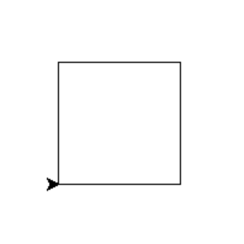

>  [Turtle Graphics | Python Documentation](https://docs.python.org/3/library/turtle.html?highlight=turtle#module-turtle)
>
>  [Turtle 海归绘图 | Python 官方文档](https://docs.python.org/zh-cn/3/library/turtle.html?highlight=turtle#module-turtle) 

## 术语解释

+ **Turtle:** Turtle 绘图体系（Turtle Graphics）最初来自于 Logo 编程语言，在 Python 中 Turtle 绘图通过随解释器一同安装的 Python 标准库 —— Turtle 库实现，Turtle 能够让我们使用简单的编程命令，轻松地绘制出精美的形状和图案。

+ **分形几何：** 分形几何学（Fractal Geometry）是一门以不规则几何形态为研究对象的几何学。 一个数学意义上分形的生成是基于一个不断迭代的方程式，即一种基于递归的反馈系统。分形有几种类型，可以分别依据表现出的精确自相似性、半自相似性和统计自相似性来定义。虽然分形是一个数学构造，它们同样可以在自然界中被找到，这使得它们被划入艺术作品的范畴。分形在医学、土力学、地震学和技术分析中都有应用。 简单的说，分形就是研究无限复杂具备自相似结构的几何学，是大自然复杂表面下的内在数学秩序。

+ **L系统：** Lindenmayer 系统（Lindenmayer-system），简称L系统（L-system），由荷兰 Utrecht 大学的生物学和植物学家 Aristid Lindenmayer 于1968年提出的有关生长发展中的细胞交互作用的数学模型，尤其被广泛应用于植物生长过程的研究。L系统是一系列不同形式的正规语法规则，多被用于植物生长过程建模，但是也被用于模拟各种生物体的形态。此外，L系统也能用于生成自相似的分形，例如迭代函数系统。

---

## 环境测试

```python
# draw1_square

from turtle import *
for i in range(4):
    forward (100)
    left(90)
exitonclick()
```


```python
# draw2_triangle

from turtle import *
for i in range(3):
    forward (100)
    left(120)
exitonclick()
```


```python
# draw3_star

from turtle import *
for i in range(5):
    forward (100)
    right(180 - 36)
exitonclick()
```


```python
# draw4_diamond

from turtle import *
length = 100
angle = 360 / 8
for i in range(2):
    forward(length)
    left(angle)
    forward(length)
    left(180 - angle)
exitonclick()
```


```python
# draw5_sun_graph

from turtle import *
from math import *

length = 100
angle = 360 / 8

# 函数：画菱形
def draw_diamond():
    for i in range(2):
        forward(length)
        left(angle)
        forward(length)
        left(180 - angle)

speed(0) 
# turtle中的speed()函数可设置海龟移动的速度为 0..10 表示的整型数值。如未指定参数则返回当前速度。
# 如果输入数值大于 10 或小于 0.5 则速度设为 0。速度字符串与速度值的对应关系如下:
    # "fastest": 0 最快
    # "fast": 10 快
    # "normal": 6 正常
    # "slow": 3 慢
    # "slowest": 1 最慢

# 画八个相邻的菱形
for i in range(8):
    if i % 2 == 0:
        color('red')
    else: 
        color('blue')
    begin_fill()
    draw_diamond()
    end_fill()
    left(angle)

# 画正八边形
forward(length)
angle_base = (180 - angle) / 2
left(180 - angle_base)

alpha = angle * pi/180 # Python中的三角函数需要以弧度为参数，需要先转换角度为弧度
step = 2 * length * sin(alpha / 2) # 八边形边长

color('yellow')
begin_fill()
for i in range(8):
    forward(step)
    left(angle)
end_fill()
hideturtle()
done()
```


---

## 分形图绘

```python
# Draw a Koch curve

import turtle as t
def koch(size, n):
    if n == 0:
        t.fd(size)
    else:
        for angle in [0, 60, -120, 60]:
            t.left(angle)
            koch(size/3, n-1)

def main():
    t.speed(0)
    t.setup(800, 400)
    t.penup()
    t.goto(-300, 50)
    t.pendown()
    t.pensize(2)
    koch(500, 4) 
    t.hideturtle()
    t.done()

main()
```


```python
# Draw a Koch snowflake

import turtle as t
def koch(size, n):
    if n == 0:
        t.fd(size)
    else:
        for angle in [0, 60, -120, 60]:
            t.left(angle)
            koch(size/3, n-1)

t.speed(0)

def main():
    t.speed(0)
    t.setup(600, 600)
    t.penup()
    t.goto(-200, 100)
    t.pendown()
    t.pensize(3)
      
    level = 3
    for i in range(3):
        koch(400, level)
        t.right(120)
        i += 1
    t.hideturtle()
    t.done()

main()
```


```python
# lsystem_test1

from turtle import * 

length = 10
angle  = 90

def draw_path(path):
    for symbol in path:
        if symbol == 'F':
            forward(length)
        elif symbol == '-':
            left(angle)
        elif symbol == '+':
            right(angle)

def apply_rule(path):
    rule = 'F-F+F+FF-F-F+F'
    return path.replace('F', rule)

speed(0)

path = 'F-F-F-F'

for i in range(2):
    path = apply_rule(path)

draw_path(path)
hideturtle()
done()
```


```python
# l-system_test2

from turtle import * 

length = 10
angle  = 90

def split_path(path):
    i = 0
    list = []
    while i < len(path):
        if path[i] == 'F':
            list.append(path[i:i+2])
            i += 2
        else:
            list.append(path[i])
            i += 1
    return list

def apply_rule(path, rules):
    list = split_path(path)
    for i in range(len(list)):
        symbol = list[i]
        if symbol in rules:
            list[i] = rules[symbol]
    path = ''.join(list) 
    return path  

def draw_path(path):
    list = split_path(path)
    for symbol in list:
        if symbol in ['Fl','Fr']:
            forward(length)
        elif symbol == '-':
            right(angle)
        elif symbol == '+':
            left(angle)
    
rules = {
    'Fl': 'Fl+Fr+',
    'Fr': '-Fl-Fr'
}

path = 'Fl'
for i in range(10):
    path = apply_rule(path, rules)

setup(800,600)
speed(0)
draw_path(path)
hideturtle()
done()
```


```python
# l-system_test3

from turtle import * 

length = 10
angle  = 60

def split_path(path):
    i = 0
    list = []
    while i < len(path):
        if path[i] == 'F':
            list.append(path[i:i+2])
            i += 2
        else:
            list.append(path[i])
            i += 1
    return list

def apply_rule(path, rules):
    list = split_path(path)
    for i in range(len(list)):
        symbol = list[i]
        if symbol in rules:
            list[i] = rules[symbol]
    path = ''.join(list) 
    return path  

def draw_path(path):
    list = split_path(path)
    for symbol in list:
        if symbol in ['Fl','Fr']:
            forward(length)
        elif symbol == '-':
            right(angle)
        elif symbol == '+':
            left(angle)
    
rules = {
    'Fl': 'Fr+Fl+Fr',
    'Fr': 'Fl-Fr-Fl'
}

path = 'Fr'

for n in range(6):
    path = apply_rule(path, rules)

setup(1000,800)
penup()
goto(-300, -200)
pendown()
speed(0)

draw_path(path)
hideturtle()
done()
```


