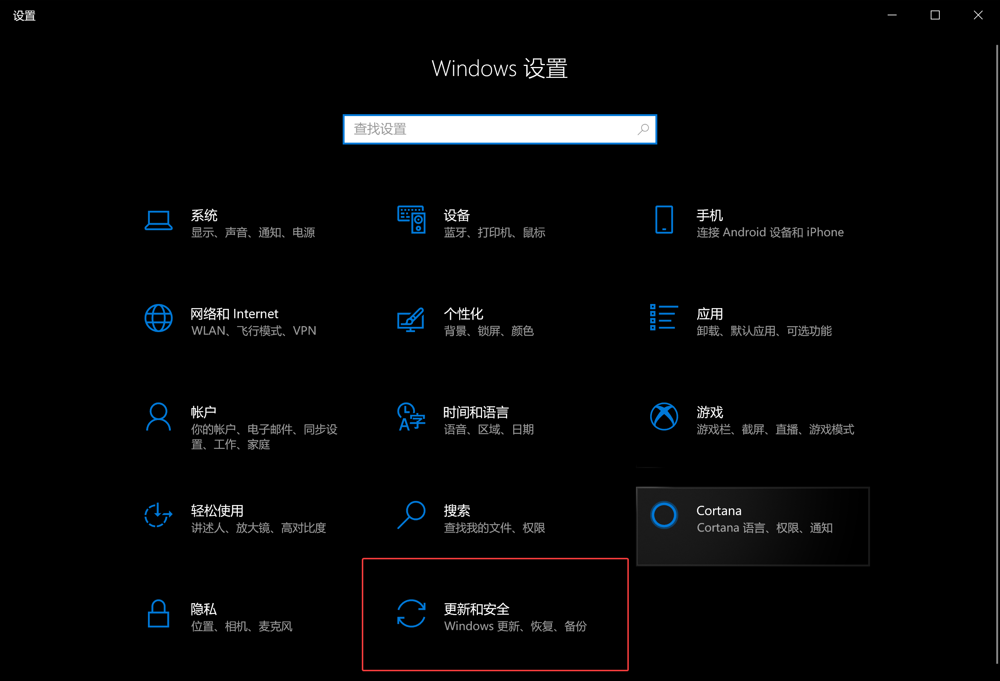

课堂上老师反复强调了系统备份的重要性，目前市面上广泛使用的桌面级操作系统均配备了比较完善的系统备份机制。以 Microsoft Windows 为例，至少从 Windows 95 版本开始，Microsoft 便一直有提供系统预装的“备份”与“还原”等功能，可用于创建系统镜像或备份指定文件，并可在用户有需要的时候进行系统还原。

---

+ Windows 98 的“备份向导”

+ Windows XP 的“备份”

+ Windows 7 的“备份”

----

在最新版的 Windows 10 操作系统中，系统级的“备份”与“恢复”得到了全面的提升，下面是我个人的系统备份与还原尝试过程：

## 1 OneDrive 的备份功能

OneDrive 是 Microsoft 旗下的云存储服务，能够在Windows、macOS、iOS、Android等操作系统上访问存储于 OneDrive 云盘内的所有文件。Windows 10 下的 OneDrive 也提供了备份用户文件的功能，仅需在 OneDrive 的设置中选择“备份”

即可将用户在“桌面”、“文档”和“图片”文件夹下的全部文件夹备份到 OneDrive 中，一旦开启此设置，相当于将用户的“桌面”、“文档”和“图片”文件夹移到了 OneDrive 的本地同步目录下，后续用户对这些文件夹中的改动也将同步到 OneDrive 中。此方法无法进行系统级的备份，但可以方便快速地备份重要的用户文件，并可在其他终端快速查看相关内容。

---

## 2 Windows 10 文件历史记录

+ 打开“设置”界面（键盘快捷键`Win+I`），点击”更新和安全“后，选择“备份”

> 如果在之前版本的 Windows 中使用“备份和还原”来备份文件或创建系统映像备份，则旧备份在 Windows 10 中仍可用。可在“控制面板”>“系统和安全”中找到“备份和还原(Windows 7)”并打开即可使用。

Windows 10 提供名为了「文件历史记录」的备份功能，默认情况下，该功能只备份存储在：文档、视频、音乐和用户桌面上的个人文件，如果有需要，也可以随时添加新的文件和文件夹位置，以便这些特定内容也得到备份。

+ 点击**添加驱动器**，此时 Windows 10 会自动搜索可用于备份的外部驱动器（包括 NAS 等网络驱动器），然后在弹出的列表中选择要作用备份目标的磁盘。

+ 一旦开启 Windows 10 的「文件历史记录」功能，我们便可以点击**更多选项**对备份频率和保留周期进行选择。

> 如果你需要**立即备份**，只需点击一下相应的按钮即可。默认备份每 1 小时进行一次，而且备份的内容在目的磁盘空间用完之前会永久保存。大家可以按需要从**下拉列表**中选择适合的备份执行频率和保留时间，对于需要备份的文件夹也可以在这里自己手动添加或删除。

+ 在选择好要备份的文件夹之后，如果希望排除一些不进行备份的子文件夹 ，可以在「排除这些文件夹」中进行添加。

+ 最后，如果你不再想进行备份，或者希望切换其它磁盘来存储备份，可以点击**停止使用驱动器**按钮。

---

## 3 Windows 10 系统镜像备份

以上两种方法主要是用于备份特定的文件夹，但如果希望对整个系统进行整体备份，我们需要创建一个**系统镜像**

+ 打开**控制面板**，点击**系统和安全**

+ 点击**备份与还原（Windows 7）**，选择左侧任务栏里的的**创建系统映像**

+ 进入**系统映像备份**界面，系统会自动搜索可用于保存系统镜像的位置，这里选择在本地磁盘（D盘）保存

> 虽然我们可以在本地磁盘上保存系统镜像，但如果本地磁盘出现故障此镜像也无法使用；因此，更加建议使用外置的移动硬盘或网络驱动器保存系统镜像。

+ 选择需要备份的系统分区和系统保留（引导分区），点击下一步开始进行备份

+ 确认备份设置，**开始备份**

+ 等待一段时间后，我们可以在我们选择的保存位置找到已创建的系统镜像

