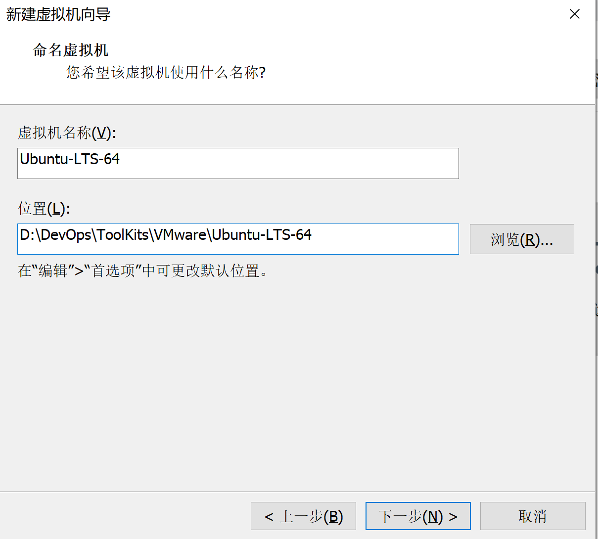

# VMware Workstation 安装 Linux 虚拟机

在学习 Git 的过程中，发现许多 Git 命令都直接来自于 Linux，毕竟 Git 最初便是为了 Linux 内核的版本管理而开发的。与此同时，身边的计算机大神们似乎都对 Linux 情有独钟、推崇有加，这也令我对 Linux 产生了好奇。

学习 Linux，从安装 Linux 开始！

---

## 1 软硬件准备

+ 宿主计算机：Dell Inspiron 7590 (Intel i7-9750H / 16GB RAM / Windows 10 Pro 1909)
+ 虚拟机平台：VMware Workstation Pro 15
+ Linux 镜像：[Ubuntu 18.04.3 LTS](https://ubuntu.com/download/desktop)
  + Tips：如果在 Ubuntu 官网下载镜像速度较慢，可以选择[从清华大学开源软件镜像站下载 Unbuntu 镜像]( https://mirrors.tuna.tsinghua.edu.cn/ubuntu/ )。

---

## 2 创建虚拟机

1. 打开VMware选择新建虚拟机 

2. 选择典型安装与自定义安装，初次体验，我选择了“典型安装”

> 典型安装：VMware会将主流的配置应用在虚拟机的操作系统上，对于新手来很友好。
>
> 自定义安装：自定义安装可以针对性的把一些资源加强，把不需要的资源移除。避免资源的浪费。

3. 载入已下载好的 Ubuntu Linux 镜像，然后点击下一步

> **注意事项：**我的机器在第一次进行这一步的时候遭遇了**“此主机不支持64位客户机操作系统”**的问题，一般有两种情况可能导致此故障：一是未开启主板的64位虚拟化技术，而是启用了 Windows 平台的 Hyper-V 或 Windows 沙盒（基于 Hyper-V 技术）
>
> **解决方案：**前一种情况需要进入 BIOS，找到选项 Intel Virtualization Technology (英特尔处理器虚拟化技术)，选择 Enabled，保存并重启，即可解决；后一种情况需要在控制面版中的“程序与功能”里取消勾选 Hyper-V 和Windows 沙盒，完成后重启电脑，即可解决。

4.  **输入用户名，密码，接着下一步** 

>+ **用户名与密码**：是用于限制权限的多用户操作系统管理工具，是登录是要输入的。
>
>+ **个性化Linux全名**：虚拟机的个性化名称(昵称)，只是对用户名的一个备注说明，登录时会显示全名。

5.  选择虚拟机名称与安装位置，尽量不要安装到C盘（因为虚拟机比较大），然后下一步 

6.   指定磁盘容量（Ubuntu 官方建议大于25GB），选择把虚拟磁盘存储为单个文件（建议单个，但多个文件也可以），接着下一步

7. 点击完成，等待虚拟机安装

8. 大功告成！开始体验 Linux！

