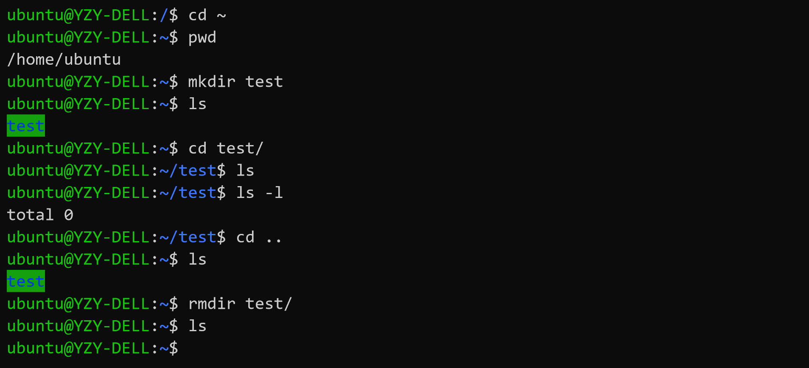
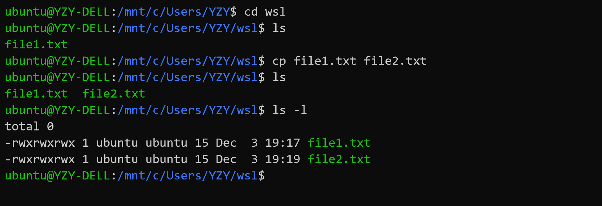

# Learn Linux Command

尽管之前尝试了使用 VMWare 和 Hyper-V 安装 Linux 虚拟机，但我在学习 Linux 基础命令时，使用了 Microsoft Windows 10 上的 WSL (Windows Subsystem For Linux) ，WSL 安装简单，使用方便，与 Windows 之间的互操作也十分强大！（特别是由于 WSL 是纯命令行界面，不会有虚拟机在高分辨率屏幕上出现字体过小、模糊等问题）！

> WSL 的官方译名是“适用于 Linux 的 Windows 子系统”，WSL 可让开发人员按原样运行 GNU/Linux 环境 - 包括大多数命令行工具、实用工具和应用程序 - 且不会产生虚拟机开销。
>
> **注意：**WSL 不适用于运行图形用户界面。 如果使用的是 WSL，将以独占方式使用命令行。
>
> **参考资料：**[WSL 官方文档](https://docs.microsoft.com/zh-cn/windows/wsl/about)

# WSL 安装与配置

1. 启用“适用于 Linux 的 Windows 子系统”可选功能

+ 以管理员身份打开 PowerShell 并运行：

  ```powershell
  Enable-WindowsOptionalFeature -Online -FeatureName Microsoft-Windows-Subsystem-Linux
  ```

+ 出现提示后，重启计算机即可。

2. 安装 Linux 分发版（ Microsoft Store 渠道）

   > 若要下载并安装首选的 Linux 分发版，有三种做法：
   >
   > - 从 Microsoft Store 下载并安装，需要 Windows 内部版本 16215 或更高版本（遵循以下步骤[检查内部版本](https://docs.microsoft.com/zh-cn/windows/wsl/troubleshooting#check-your-build-number)。）
   > - 从命令行/脚本下载并安装（[阅读手动安装说明](https://docs.microsoft.com/zh-cn/windows/wsl/install-manual)）
   > - 下载并手动解压缩和安装（适用于 Windows Server - [参阅此处的说明](https://docs.microsoft.com/zh-cn/windows/wsl/install-on-server)）

+ 打开 Microsoft Store，搜索 "Linux” ，选择 Linux 分发版（推荐 Ubuntu）


+ 在分发版的页面中，选择“获取 (Get)”，然后“安装 (Install)”


3. 安装 Linux 分发版后，必须先初始化一次后才能使用

+ 启动 WSL，首次运行新安装的分发版时，会打开一个控制台窗口，其中指出需要等待一两分钟时间来完成安装。
+ 安装完成后，系统会提示创建新的用户帐户（及其密码）

> 此用户帐户用于启动分发版时默认登录的非管理员用户，它与 Windows 用户名无关。
>
> 打开新的分发版实例时，系统不会提示你输入密码，但**如果使用 `sudo` 提升了进程的权限，则需要输入密码**
>
> **注意：**Linux/Unix 在输入密码的时候不会有任何提示，Unix的哲学是“没有消息就是好消息”！

4. 更新和升级分发版的包

+ Windows 不会自动更新或升级 Linux 分发版，需要使用 Linux 分发版的包管理器升级已安装的包，建议定期更新。

+ 在 Debian/Ubuntu 上使用 `apt` 命令：

    ```bash
    sudo apt update && sudo apt upgrade
    ```

+ 执行结束，大功告成！


---

# Linux 基础命令

> **参考资料：**[Linux 入门教程](https://space.bilibili.com/24014925/channel/detail?cid=12754)

+ 打开 Ubuntu 命令行。 

> 命令行也被称为 Bash Shell、终端、控制台、命令行接口 (CLI)，或对于 Windows 更常见的命令提示符，这些术语常常互换使用。


+ `date`命令：获取当前日期与时间


+ `cal`命令：打印日历


+ `clear`命令：清屏

+ Linux 基本文件操作

    1. `pwd`命令：当前工作目录
    2. `cd`命令：切换目录（Linux 中的根目录被称为`root`目录，使用`/`表示）
    3. `ls`命令：查看当前目录下的文件（可使用`ls -l`查看文件详情）
    
    
    
    4. `mkdir`命令：创建文件夹
    5. `rmdir`命令：删除文件夹（需要先切换至上层目录，键入几个字符后按 Tab 键会自动完成文件名或路径。）
       
    
    
	
	6. `cp`命令：复制文件
	
	
	
	7. `cat`命令：查看文本内容
	
	
	
	8. `diff`命令：查看文件差异（修改`file2.txt`后比较）
	
	
	
	9. `head`命令：查看文件头（可加参数`-n`）
	10. `tail`命令：查看文件尾（可加参数`-n`）
	
	
	
	11. `wc`命令：统计字符（默认为：`<行数-l> <单词数-w> <字符数-c> <文件名>  `，可加参数进行限定）
	
	
	
	12. `rm`命令：删除文件（注意：Linux 没有“回收站”机制，直接使用`rm`要谨慎）
	
	
	
	13. `mv`命令：移动文件或重命名文件（注意：文件夹名也是大小写敏感的！）
	
	
	
	
	
	14. `less`命令：浏览文件（可移动光标），点击字母`q`退出
	
	
	
	
	
	15. `chmod`命令：修改文件读写权限
	
	+ `chmod`命令分为三部分：u作者，g小组成员，o其他成员；
	+ 每一部分里面都有：r读，w写，x运行三个部分；
	+ 如果想修改权限的话 chmod u-r 文件名称 代表修改了作者的权限，不能够读。如果想添加权限 chmod u+r 文件名称 代表允许可读权限。如果使用 chmod g-r 文件名称 代表小组成员和其他人都不能读。
	
	
	
	
	
	
	
	
	
	+ `chmod`也可以通过二进制数（转十进制）进行操作
	
	
	
	
	
	
	
	16. `grep`命令：对文本文件进行搜索
	    + `grep`命令可以对文本文件的内容进行搜索，使用正则表达式，能够更好的查找想要的内容，还可以使用命令组合来实现更好的定位。
	
	

---

## 小结1

> + 引自：https://blog.csdn.net/Desdemonali/article/details/99086515
>
> 1. 输入 date 来查看当前的时间和日期，输入 cal（calendar）来查看的本月的日历，使用cal+年 查看某一年的总日历，使用 cal 月 年 来查看具体某年某月的日历。
> 2. Linux的最高目录是root，常用 / ，与win有所区别，可以用pwd命令来查看自己所在的文件位置，想要跳转位置，cd  /  来跳回到根目录，用 ls 命令可以列出当年目录下的所有文件。ls -l 能够查看文件夹下所有文件的具体创建时间和具体的信息。如果文件的最前面是 d，就代表这个文件是文件夹，如果对应的是 - 则代表是文件。用命令 cd 文件夹名称 就进入了这个文件夹，如果想看这个文件夹中有哪些具体内容，输入 ls 即可。如果想看这个文件夹中的文件属于什么类型，输入 ls -l 即可。
> 3. 如果觉得屏幕上面比较乱，可以输入 clear 来清除多余的内容。
> 4. 想要从当前的目录退回到上一层的目录可以用 cd ..来实现，如果想要新建文件夹 mkdir 文件夹名字 在当前的目录下创建一个新的文件夹，如果创建错误的话，可以用 rmdir 文件夹名字来实现文件夹的删除。
> 5. 复制文件的命令是 cp 复制文件的名字 复制出的文件新的名字，可以用 ls -l 语句查看文件的具体信息，看看是否相同，如果相同则证明文件复制成功，或者用 diff  文件1名称 文件2名称 如果没有结果，则表明两个文件内容完全相同，否则将会出现提1示，说明两个文件不同。
> 6. 如果想要查看文件的具体内容，可以使用 cat 文件名称 来实现。
> 7. 命令 head 文件名称 -n 数字 表示查看文件的文件头，文本文件的前n行的内容。
> 8. 命令 tail 文件名称 -n 数字 表示查看文件的文件尾，文本文件的最后n行内容。
> 9. wc命令是word count的缩写，查看文件有多少个单词，wc 文件名 查找之后显示文件的行数、文件的单词数目、文件的字符数。如果想要查找文件的单词数，可以用 wc -w 文件名 来实现。 想要查找文件有多少行，可以用 wc -l 文件名称 来实现。想要查看文件的字节数可以用 wc -c 文件名称 来实现。
> 10. rm 文件名称 可以直接删除文件，但是删除文件有风险，LInux中不能够把删除的文件从回收站收回。
> 11. mv 命令可以修改文件名和移动文件。mv 文件1名称 文件1新的名称 这样将文件1的名字改成了新的名称。mv 文件名称 文件夹名称 移动文件到文件夹中。注意Linux里面大小写敏感，要注意文件的名字。
> 12. less命令类似于文件浏览器，使用 less 文件名称 能够使用上下左右键查看文件中的内容，按 【q】 能够返回命令行模式，退出查看。
> 13. chmod命令分为三部分：u作者，g小组成员，o其他成员。每一部分里面都有：r读，w写，x运行三个部分。如果想修改权限的话 chmod u-r 文件名称 代表修改了作者的权限，不能够读。如果想添加权限 chmod u+r 文件名称 代表允许可读权限。如果使用 chmod g-r 文件名称 代表小组成员和其他人都不能读。chmod命令使用二进位表示为三位。
> 14. grep命令可以对文本文件的内容进行搜索。grep 想要搜索的内容 文件名称 就可以搜索文件中是否含有内容。
> 15. 想要更好的运用grep语句，最好和正则表达式联系起来，能够更好的查找想要的内容。
> 16. 可以使用命令组合来实现更好的定位等。